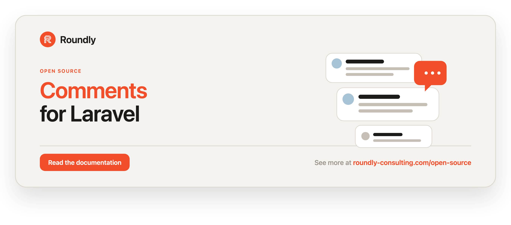

<!-- roundly-hero:start -->
<p align="center">
  <a href="https://roundly-consulting.com/open-source/docs/comments-for-laravel?utm_source=github&utm_medium=readme&utm_campaign=open-source&utm_content=comments-for-laravel">
    
  </a>
</p>
<!-- roundly-hero:end -->

# Comments for Laravel

Attach polymorphic comments to any Laravel model. Any model can *give* comments and any
model can *receive* them — including comments themselves, so you get threaded replies for
free. The package ships a single morph-based `comments` table, two opt-in traits, and a
`CommentCreated` event you can hook into.

## Requirements

- PHP 8.3 or higher
- Laravel 12 or 13

## Installation

```bash
composer require roundly-consulting/comments-for-laravel
```

Publish and run the migration:

```bash
php artisan vendor:publish --tag="comments-migrations"
php artisan migrate
```

Optionally publish the config file:

```bash
php artisan vendor:publish --tag="comments-config"
```

## Configuration

The published config file lives at `config/comments.php`:

```php
<?php

declare(strict_types=1);

use RoundlyConsulting\Comments\Models\Comment;

return [

    'model' => Comment::class,

];
```

| Key     | Type           | Default          | Description |
|---------|----------------|------------------|-------------|
| `model` | `class-string` | `Comment::class` | The Eloquent model used to store comments. Point this at your own model (extending `RoundlyConsulting\Comments\Models\Comment`) if you need extra columns, casts, or behaviour. |

The package works with zero configuration — publishing the config is only needed when you
want to swap in a custom comment model.

## Usage

### Preparing your models

Add `HasComments` to anything that can be commented on, and `GivesComments` to anything that
can author a comment (typically your `User`):

```php
use Illuminate\Database\Eloquent\Model;
use RoundlyConsulting\Comments\Traits\HasComments;
use RoundlyConsulting\Comments\Traits\GivesComments;

class Post extends Model
{
    use HasComments;
}

class User extends Model
{
    use GivesComments;
}
```

### Writing a comment

`GivesComments` adds a `writeComment()` method. Pass the model being commented on, the body,
and an optional visibility flag (defaults to `true`):

```php
$post = Post::find(1);
$user = auth()->user();

$comment = $user->writeComment(
    commentable: $post,
    comment: 'This is a very good blog post, thanks for sharing!',
    visible: true, // optional, defaults to true
);
```

`writeComment()` returns the created `Comment` instance.

### Reading comments

```php
$post->comments;        // every comment written on the post
$user->writtenComments; // every comment authored by the user

$comment->actor;        // the model that wrote the comment
$comment->commentable;  // the model the comment was written on
```

### Threaded replies

A comment is itself commentable, so replying is just commenting on a comment. Use
`commentsWithReplies` to eager-load the whole tree:

```php
$reply = $user->writeComment(
    commentable: $comment, // reply to an existing comment
    comment: 'Glad you liked it!',
);

$post->commentsWithReplies; // comments with their nested replies loaded
```

### Reacting to new comments

Every created comment dispatches `RoundlyConsulting\Comments\Events\CommentCreated`, which
carries the new comment on its `$comment` property. Listen for it to send notifications,
moderate content, and so on:

```php
use RoundlyConsulting\Comments\Events\CommentCreated;

Event::listen(function (CommentCreated $event): void {
    // $event->comment is the freshly created Comment
    Notification::send(
        $event->comment->commentable,
        new NewCommentNotification($event->comment),
    );
});
```

## Testing

```bash
composer test
```

## Changelog

Please see [CHANGELOG](CHANGELOG.md) for more information on what has changed recently.

## License

The MIT License (MIT). Please see [License File](LICENSE.md) for more information.
